```mermaid
flowchart TD
    A[Structures Overview] 
    A --> B[1. Basics]
    A --> C[2. Arrays]
    A --> D[3. Pointers]
    A --> E[4. Nested]
    A --> F[5. C vs C++]
    
    B --> B1["struct TypeName<br/>int x, y;"]
    B --> B2["Point p = {10,20};<br/>p.x → dot operator"]
    B --> B3["Size: 8 bytes<br/>4+4 + padding"]
    
    C --> C1["struct S s[3] =<br/>{{1,'A'}, {2,'B'}}"]
    C --> C2["Count: sizeof(s)/<br/>sizeof(s[0])"]
    
    D --> D1["Node* p = malloc(..)"]
    D --> D2["p→data = 10<br/>(*p).data"]
    D --> D3["Always free(p)"]
    
    E --> E1["struct Date {int d,m,y};"]
    E --> E2["struct Emp {..<br/>struct Date join; }"]
    E --> E3["emp.join.d"]
    
    F --> F1["C: No methods<br/>C++: Methods OK"]
    F --> F2["C: Manual init<br/>C++: Constructor"]
    F --> F3["Both: Padding exists"]
    
    style A fill:#e3f2fd
    style B fill:#f3e5f5
    style C fill:#e8f5e8 
    style D fill:#fff3e0
    style E fill:#e0f2f1
    style F fill:#fce4ec
```

# Basics
# 1. Simple Structure Declaration and Access (C/C++)

```cpp
#include <stdio.h>

struct Point {
    int x;
    int y;
};

int main() {
    struct Point p1 = {10, 20};
    printf("Point coordinates: (%d, %d)\n", p1.x, p1.y);
    return 0;
}
```

OUTPUT :-
```
Point coordinates: (10, 20)
```

LOGIC :-
```
struct Point defines a custom data type with two int members

p1 = {10, 20} uses designated initialization to set x=10, y=20

Dot operator . accesses structure members directly

Memory layout: 8 bytes total (4 bytes for x + 4 bytes for y)
```

# 2. Structure with Functions (C++)

```cpp
#include <iostream>
using namespace std;

struct Rectangle {
    int width, height;
    
    int area() {
        return width * height;
    }
};

int main() {
    Rectangle r = {5, 10};
    cout << "Area: " << r.area() << endl;
    return 0;
}
```

OUTPUT :-
```
Area: 50
```

LOGIC :-
```
C++ allows member functions inside struct (unlike C)

area() function has direct access to width and height

Called as r.area() - function belongs to the structure instance

Inline function for better performance on simple calculations
```

# 3. Array of Structures (C/C++)

```cpp
#include <stdio.h>

struct Student {
    int roll_no;
    char name[20];
};

int main() {
    struct Student class[3] = {
        {101, "Alice"},
        {102, "Bob"},
        {103, "Charlie"}
    };
    
    for(int i = 0; i < 3; i++) {
        printf("Roll: %d, Name: %s\n", class[i].roll_no, class[i].name);
    }
    return 0;
}
```

OUTPUT :-
```
Roll: 101, Name: Alice
Roll: 102, Name: Bob
Roll: 103, Name: Charlie
```

LOGIC :-
```
Array of structures: each element is a complete Student (24 bytes each)

Aggregate initialization fills array in declaration order

class[i].roll_no accesses member of ith structure

Total memory: 72 bytes (3 × 24 bytes)
```

# Intermediate Level
# 1. Nested Structures (C/C++)

```cpp
#include <stdio.h>

struct Date {
    int day, month, year;
};

struct Employee {
    int id;
    char name[30];
    struct Date joining_date;  // Nested structure
};

int main() {
    struct Employee emp = {1001, "John Doe", {15, 6, 2025}};
    printf("Employee: %s, Joined: %d/%d/%d\n", 
           emp.name, emp.joining_date.day, 
           emp.joining_date.month, emp.joining_date.year);
    return 0;
}
```

OUTPUT :-
```
Employee: John Doe, Joined: 15/6/2025
```

LOGIC :-
```
joining_date is a nested structure (12 bytes inside 44-byte Employee)

Access nested members: emp.joining_date.day

Initializer nesting: {15, 6, 2025} fills Date structure fields sequentially

Memory layout: Employee = id(4) + name(30) + Date(12) = 46 bytes (with padding)
```

# 2. Structure Pointers (C)

```cpp
#include <stdio.h>
#include <stdlib.h>

struct Node {
    int data;
    struct Node* next;
};

int main() {
    struct Node* head = malloc(sizeof(struct Node));
    head->data = 42;
    head->next = NULL;
    
    printf("Node data: %d\n", head->data);
    free(head);
    return 0;
}
```

OUTPUT :-
```
Node data: 42
```

LOGIC :-

```
malloc(sizeof(struct Node)) allocates 8 bytes dynamically

-> operator dereferences pointer to access members: (*head).data

head->next = NULL marks end of linked list

Always free() allocated memory to prevent leaks
```

# 3. Self-Referential Structures (C++)

```cpp
#include <iostream>
using namespace std;

struct Node {
    int data;
    Node* next;
    
    void display() {
        cout << "Data: " << data << endl;
    }
};

int main() {
    Node n1;
    n1.data = 100;
    n1.next = nullptr;
    n1.display();
    return 0;
}
```

OUTPUT :-
```
Data: 100
```

LOGIC :-

```
Node* next creates self-referential structure for linked lists

Forward declaration implicit in C++ (unlike C requiring pointer typedef)

nullptr is modern C++ null pointer (safer than NULL)

Member function display() shows C++ struct capabilities
```


```
| Feature           | C Structures       | C++ Structures |
| ----------------- | ------------------ | -------------- |
| Methods           | ❌ Not allowed      | ✅ Allowed      |
| Constructors      | ❌ Manual init      | ✅ Automatic    |
| Pointer syntax    | (*ptr).member      | ptr->member    |
| Memory management | Manual malloc/free | RAII preferred |
```
